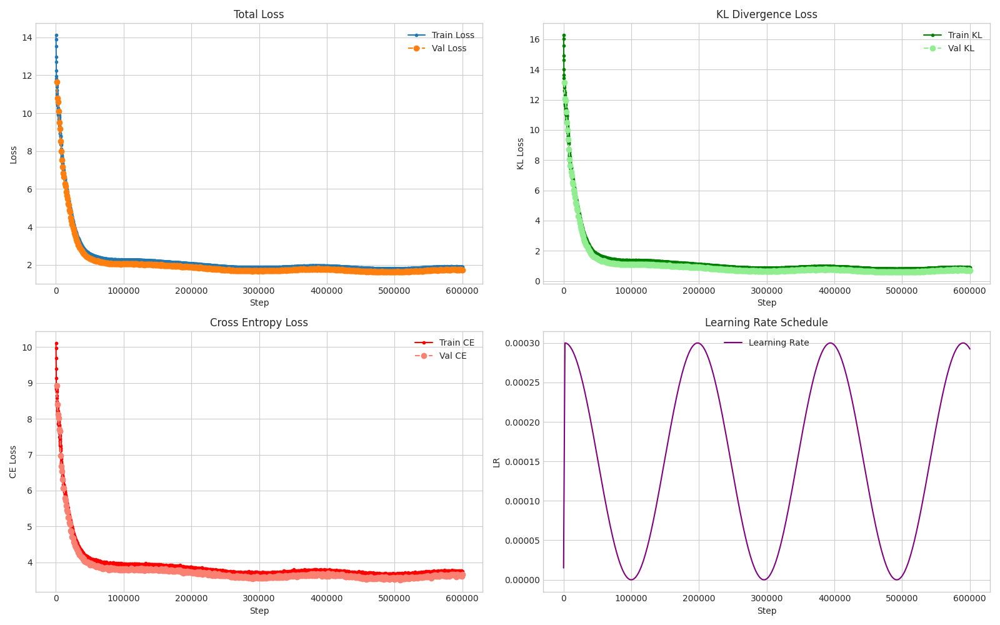
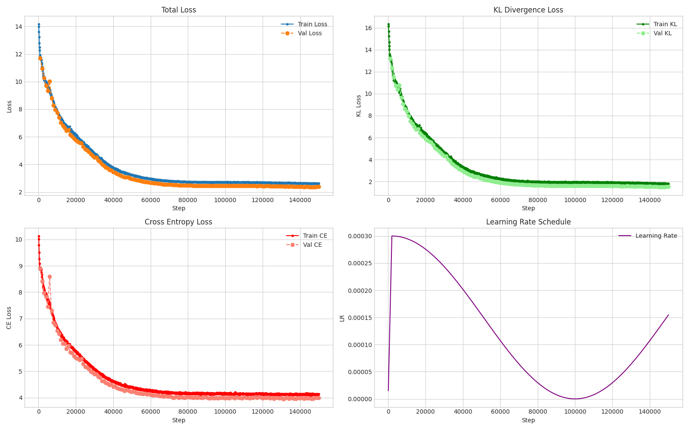

# Geneformer-Distilled 4M

This is a part of our seminar at the instite of statistics at LMU Munich. 

Here we are trying to distill a 4M parameter model from 10M parameter model which is the geneformer, considered one of the seminal work in network biology. We have managed to compress the model from 10M to 4M around 2.5x reduction with around 1/25th of the data and 1/100th of the training with with identical things. It was abit challenging to replicate this paper because there were a lot of things missings like 

1. Even to download files from hugging face is a mess
2. Needed to create a custom data collator due to variable length sampling $\to$ to save computing
3. Due to variable sequence length failed to use `torch.compile()` which builds a dynamic CUDA graph. 
4. Compute challenges, the data is massive with around 27 Mn rows and 500 tokens per sequences.  
5. Data was pretokenized that helped but also it was the most important part of the paper, needed to build our own collator. 
6. General Clarity Needed on what is the BERT masking strategy.
7. The dataset for the V2 models are not being provided 104 M
8. Working with a 27 Mn rows with 500 tokens amounts to 10B tokens approx, really difficult to work with it. Major optimizations in dataset.py

In general it proved difficult to replicate but not impossible. 

We have the following training metric 
 

and the weights of the distilled models can be found in the outputs/checkpoints we are going to use the model_best.pt

To run the evaluations you need to do : 

```python
    python3 -m src.evals.quick
```

As we have been training a language model with masking we are evaluating it on 

1. Accuracy : Of the masking of the tokens
2. Perplexity : Measure of how confident the model is while predicting the masked tokens

The current numbers suggests that everything is working just we need to train our model more for more duration because currently it is only being trainined on 1.2 Mn rows instead of 27 Mn rows so it has not seen enough data. 

Update : If we train it more then the accuracy improves over time but the marginal gains are less, we increased the training steps from 61000 to 91000, we saw on improvement of 2% of MLM accuracy and perplexity improved by 40%.

```bash
============================================================
Metric          | Teacher (Target)   | Student (Yours)    | Gap       
MLM Accuracy    | 0.3059             | 0.2534             | -0.0524
Perplexity      | 15.40              | 22.48              | +7.08
============================================================
```

We have seen the data scaling working here, if you train it on more data the results including the MLM Accuracy and the perplexity improves, though measuing perplexity here doesn't make much sense except to predict the models confidence on the Masked Predictions. 

Currently training the 3M geneformer model with the minor config difference of `hidden_size` or `d_model` being reduced from 128 to 96 and the `intermediate size` ratio being kept the same at **4**

#### Results for Geneformer3M 
 

```bash
============================================================
Metric          | Teacher (Target)   | Student (Yours)    | Gap       
MLM Accuracy    | 0.3028             | 0.1864             | -0.1164
Perplexity      | 15.59              | 38.91              | +23.32
============================================================
```

I must say that, this might not be a bad down shrinking, probably training them more will improve the accuracy for sure, because it has not seen enough data, maybe we should train this more around 50000 steps more.

Did train for 50000 more steps, I think the model has converged and training is not helping here any more. May be related to more capacity based issues rather than hyper parameters and stuff like that. 

So a new learning, I think I might have observed double descent in the Geneformer. Suddenly after 150000 steps the model started to converge more, so I saw accuracy improvements from 0.21 to 0.24, now almost performing as similarly as the teacher model. This makes me imagine what if we train it more, will probably do that and what are the limits of distillation. 